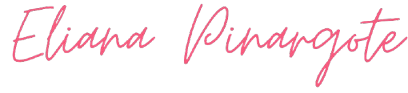

  

<!-- Social icons section -->

  

<h3 align="left">Languages and Tools:</h3>
         

 

  

 

  <b>Software Engineering Student</b>
   
  🏫 <i>Escuela Politécnica Nacional</i>
    

  
  
    

  Passionate about Web Development and creating functional, attractive interfaces.
 
I enjoy building projects from scratch using code or designing dynamic sites with WordPress.
  
Additionally, I have a strong focus on Requirements Engineering and the Software Development Life Cycle (SDLC), with a solid understanding of Plan-Driven approaches.

  ✨ <i>"Transforming creative ideas into clean and efficient software solutions."</i>

